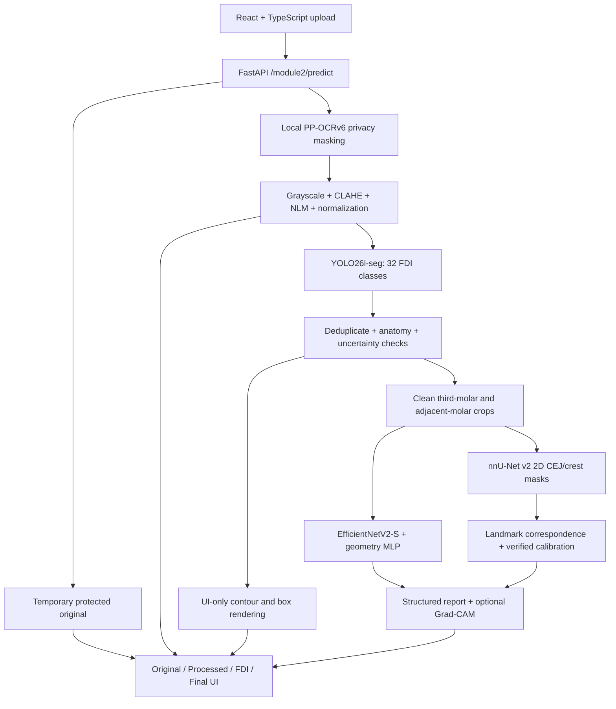

# Module 2 architecture

`app/main.py` validates requests and protects artifact retrieval; `app/pipeline.py` orchestrates independently loaded model adapters. `app/services/` contains preprocessing, privacy, FDI, impaction, bone and report logic. Pydantic models define the JSON contract. Annotated images never enter model inference.

`app/storage.py` stores metadata in PostgreSQL (SQLite for local development), private derived artifacts locally or in S3, and original rendered pixels locally. Expiring session capabilities isolate cases. Uploaded binaries/DICOM metadata are not persisted. No raw URL is written into report metadata. This is not a replacement for institutional authentication.

`frontend/src/pages/Module2Research.tsx` implements the four-stage interface and `frontend/src/api/module2.ts` handles uploads and protected artifact fetching. Object URLs are revoked when cases change. `api-gateway/app/routes/module2.py` forwards the same session header and canonical endpoints.

Missing models produce degraded health and empty/unavailable stage results. Privacy failure stops downstream processing. FDI uncertainty prevents dependent inference. Missing spacing or ambiguous landmarks prevents millimetre measurements. No estimated severity or full-mouth periodontal diagnosis is emitted.

The service is a research implementation awaiting trained artifacts and validation. The current landmark correspondence uses component centroids and abstention on ambiguous/tilted cases; it is not clinically validated. See the [module guide](../services/module2-impaction-boneloss/README.md) and [ordered training protocol](../services/module2-impaction-boneloss/training/HYBRID_TRAINING.md).
